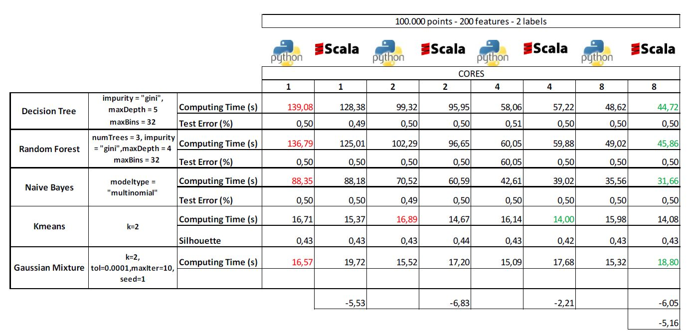
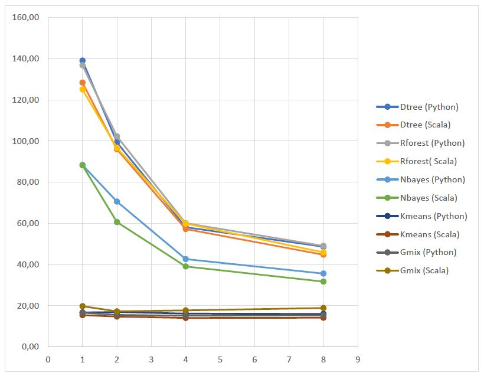
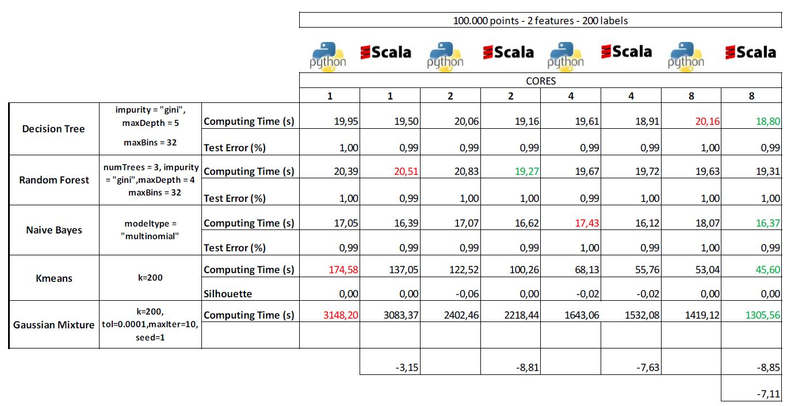
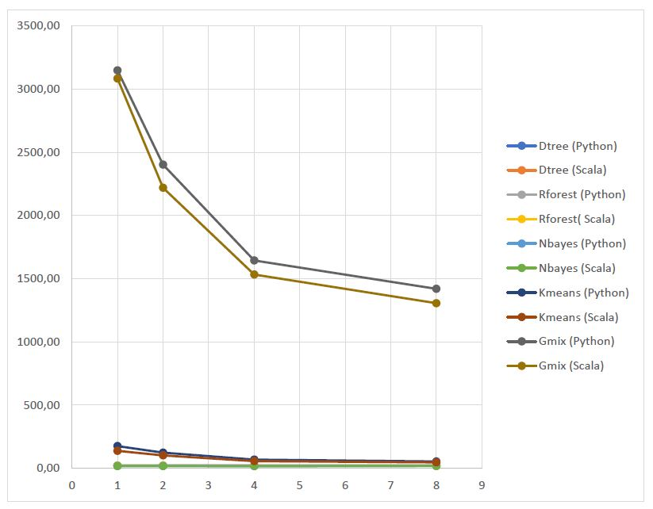
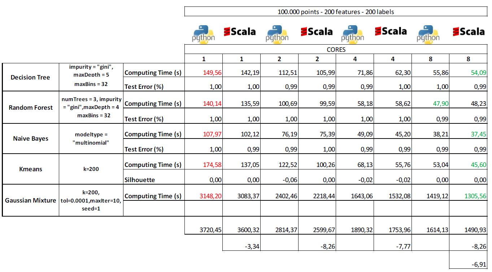
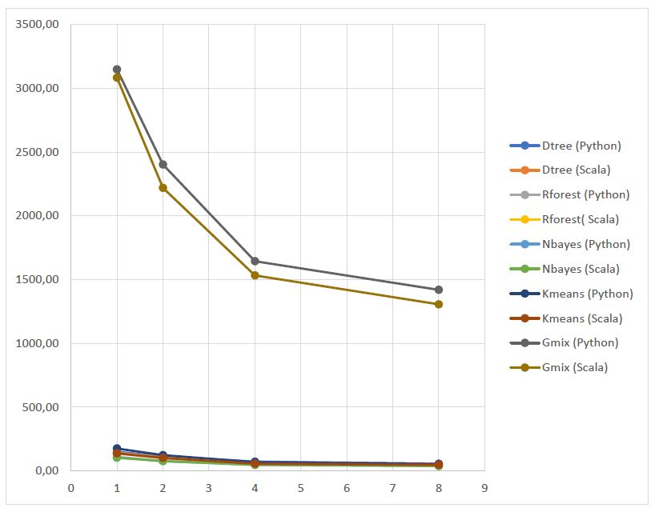

#SPARK MLlib 
#Performance assessment of PyCharm machine learning algorithms

#

**This is an open task aimed at assessing the performance of some of the machine learning algorithms provided by PyCharm. The idea is to generate a number of data sets for clustering and classification using the provided data generators and evaluate the performance of the training step with 1, 2, 4 and 8 cores. The choice of the algorithms and the size of the datasets (number of rows and number of features) are up to you (as a hint, the time required to make the training should be at least higher that two or three minutes with one core in order to get speed-ups with up to 8 cores).**

There are also a develop a Scala version of algorithms are compare them against the Python version. 

For this exercise we will choose 3 Classifications Models and 2 Clustering Models:

Classifications:

- Decision Tree
- Random Forest
- Naive Bayes

Clustering

- Kmeans
- Gaussian Mixture
- LDA (It´s implemented but we will not include it because it takes a lot of time)

We also will choose 3 data examples to analyze the behaviour:

1. 000 points - 200 features - 2 labels
2. 000 points - 2 features - 200 labels
3. 000 points - 200 features - 200 labels

For all the samples we will analyze the behaviour with 1, 2, 4 and 8 cores

The characteristics of the computer we use to make these exercises are:

- Microsoft Windows [Version 10.0.16299.309]
- Processor Intel(r) Core™ i7-2600 CPU @ 3.40GHz × 8
- 16 GB RAM
- Spark 2.3.0
- java version &quot;1.8.0\_161&quot;

- Java(TM) SE Runtime Environment (build 1.8.0\_161-b12)
- Java HotSpot(TM) 64-Bit Server VM (build 25.161-b12, mixed mode)

# Analysis:

# Conclusions:

There an excel page with all the conclusion in the file **Analysis of perfomance.xlsx.** There, on the excel, you can select the charts you want to see and compare.

We can see basically that in the 3 samples with all the models SCALA is faster than Python

1. 000 points - 200 features - 2 labels
2. 000 points - 2 features - 200 labels
3. 000 points - 200 features - 200 labels

In Sample 1 SCALA is 5,91% faster than Python

In Sample 2 SCALA is 7,11% faster than Python

In Sample 3 SCALA is 6,91% faster than Python

The different are bigger when the number of cores is higher

For example

With 8 cores SCALA is 7,72% faster than Python

With 4 cores SCALA is 5,87% faster than Pyhton

With 2 cores SCALA is 7,96% faster than Pyhton

With 1 cores SCALA is 4,00% faster than Pyhton
